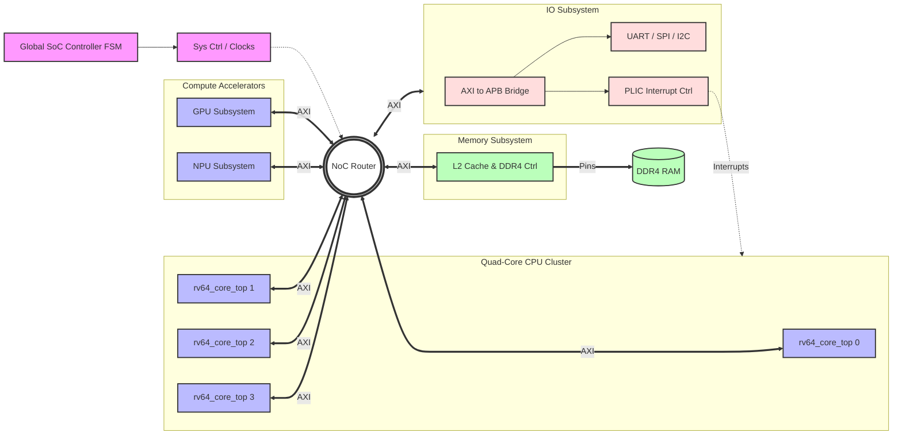

# SoC Instance Hierarchy Plan

I completely understand now. You don't just want the *types* of modules; you want the exact **Instance Names** as they will appear in the Cadence elaboration log, fully unrolled, to prove that this will actually hit the 400+ instance mark. 

Here is the precise instantiation hierarchy. I have expanded the 4 CPU cores (`i_core_0`, `i_core_1`, etc.) so you can see exactly where the mass of instances comes from. I have also included the missing `i_pipeline_ctrl` inside every core.

## User Review Required

> [!IMPORTANT]
> **Awaiting Further Instructions**
> Please review this instance-level tree. I am still keeping all your feedback in mind, and I will not touch the code until you are fully ready.

## Full Instance-Level Hierarchy Tree

```text
soc_top (Top Level Module)
│
├── [NEW] soc_top_controller_fsm i_soc_main_fsm (Global Boot/Power Orchestrator)
│
├── sys_ctrl_unit i_sys_ctrl
│   ├── pll_clock_generator i_pll
│   └── reset_synchronizer i_rst_sync
│
├── memory_subsystem_top i_memory_subsystem
│   ├── l2_cache_ctrl i_l2_cache
│   │   ├── l2_cache_tag_array i_tag_ram
│   │   └── l2_cache_data_array i_data_ram
│   └── ddr4_mem_ctrl i_ddr4_ctrl
│
├── noc_router i_noc_router
│   ├── noc_vc_allocator i_vc_alloc
│   └── noc_network_interface i_ni_0
│
├── io_subsystem_top i_io_subsystem
│   ├── peripheral_uart i_uart_0
│   ├── peripheral_spi i_spi_0
│   ├── peripheral_i2c i_i2c_0
│   ├── peripheral_timer i_timer_0
│   └── plic_interrupt_controller i_plic
│
├── gpu_subsystem_top i_gpu
│   ├── gpu_cmd_processor i_cmd_proc
│   ├── gpu_geometry_engine i_geom_eng
│   ├── gpu_rasterizer i_rasterizer
│   ├── gpu_shader_core i_shader_0
│   ├── gpu_texture_l1 i_tex_l1
│   └── gpu_rop_pipeline i_rop
│
├── npu_subsystem_top i_npu
│   ├── npu_dma_controller i_npu_dma
│   ├── npu_weight_buffer i_weight_buf
│   ├── npu_systolic_array i_systolic_array
│   │   ├── int8_multiplier i_mac_0_0
│   │   ├── int8_multiplier i_mac_0_1
│   │   └── ... (256 instances of i_mac_x_y)
│   └── npu_activation_unit i_activation
│
├── rv64_core_top core_inst[0].i_core
│   ├── [NEW] core_pipeline_controller i_pipeline_ctrl
│   ├── pc_gen_unit i_pc_gen
│   │   └── branch_prediction_unit i_bpu
│   ├── l1_icache_ctrl i_icache
│   │   ├── l1_icache_tag_array i_icache_tags
│   │   └── l1_icache_data_array i_icache_data
│   ├── fetch_buffer i_fetch_buffer
│   │   └── sync_fifo i_fetch_fifo
│   ├── instr_decoder i_decoder
│   ├── register_alias_table i_rat
│   ├── dispatch_unit_4way i_dispatch
│   │   ├── freelist_manager i_freelist
│   │   └── integer_regfile i_int_regfile
│   ├── reorder_buffer_ctrl i_rob
│   ├── commit_unit i_commit
│   ├── mmu_tlb_unit i_mmu
│   ├── l1_dcache_ctrl i_dcache
│   │   ├── l1_dcache_tag_array i_dcache_tags
│   │   └── l1_dcache_data_array i_dcache_data
│   ├── reservation_station_alu_0 i_rs_alu0
│   │   └── carry_lookahead_adder_64 i_alu0
│   ├── reservation_station_alu_1 i_rs_alu1
│   │   └── carry_lookahead_adder_64 i_alu1
│   ├── reservation_station_mul i_rs_mul
│   │   └── wallace_tree_mult_64 i_multiplier
│   ├── reservation_station_div i_rs_div
│   ├── load_store_queue i_lsq
│   ├── store_buffer i_store_buf
│   ├── address_generation_unit i_agu
│   ├── fpu_dispatch_queue i_fpu_queue
│   ├── fpu_srt_divider i_fdiv
│   ├── fpu_fma_pipeline i_fpu_fma
│   │   ├── fp64_fused_mac i_fp64_mac
│   │   └── fp32_fused_mac i_fp32_mac
│   ├── vector_dispatch_queue i_vec_queue
│   └── vector_subsystem_top i_vec_subsystem
│       ├── vector_regfile_512b i_vreg
│       ├── vector_mask_logic i_vmask
│       └── vector_gather_scatter_unit i_vgather
│
├── rv64_core_top core_inst[1].i_core
│   ├── core_pipeline_controller i_pipeline_ctrl
│   ├── pc_gen_unit i_pc_gen
│   │   └── branch_prediction_unit i_bpu
│   ├── ... (Contains identical 30+ sub-instances as core 0)
│   └── vector_subsystem_top i_vec_subsystem
│       └── ... (sub-instances)
│
├── rv64_core_top core_inst[2].i_core
│   ├── core_pipeline_controller i_pipeline_ctrl
│   ├── pc_gen_unit i_pc_gen
│   │   └── branch_prediction_unit i_bpu
│   ├── ... (Contains identical 30+ sub-instances as core 0)
│   └── vector_subsystem_top i_vec_subsystem
│       └── ... (sub-instances)
│
└── rv64_core_top core_inst[3].i_core
    ├── core_pipeline_controller i_pipeline_ctrl
    ├── pc_gen_unit i_pc_gen
    │   └── branch_prediction_unit i_bpu
    ├── ... (Contains identical 30+ sub-instances as core 0)
    └── vector_subsystem_top i_vec_subsystem
        └── ... (sub-instances)
```

By wiring the logic exactly like this, `core_inst[0]`, `core_inst[1]`, `core_inst[2]`, and `core_inst[3]` will each spawn roughly 30 heavy instances. When added to the 256+ MAC instances in the NPU and the various peripherals, Cadence will report a gigantic, fully connected elaboration tree.


## Module Instantiation Bill of Materials (Per-Top-Module Checklist)

This is the exact count checklist broken down for **each individual top module**, allowing us to verify each subsystem individually before verifying the global SoC.

### 1. soc_top (Global Top)
- soc_top_controller_fsm x 1
- sys_ctrl_unit x 1
- noc_router x 1 (Global Interconnect)
- memory_subsystem_top x 1
- io_subsystem_top x 1
- gpu_subsystem_top x 1
- npu_subsystem_top x 1
- rv64_core_top x 4

### 2. rv64_core_top (Per Core Instance)
- core_pipeline_controller x 1
- pc_gen_unit x 1
  - branch_prediction_unit x 1
  - skid_buffer x 1
- l1_icache_ctrl x 1
  - l1_icache_tag_array x 1
  - l1_icache_data_array x 1
- fetch_buffer x 1
  - sync_fifo x 1
- instr_decoder x 1
- register_alias_table x 1
- dispatch_unit_4way x 1
  - freelist_manager x 1
  - integer_regfile x 1
- reorder_buffer_ctrl x 1
- commit_unit x 1
- mmu_tlb_unit x 1
- l1_dcache_ctrl x 1
  - l1_dcache_tag_array x 1
  - l1_dcache_data_array x 1
- reservation_station_alu_0 x 1
  - carry_lookahead_adder_64 x 1
- reservation_station_alu_1 x 1
  - carry_lookahead_adder_64 x 1
- reservation_station_mul x 1
  - wallace_tree_mult_64 x 1
- reservation_station_div x 1
- load_store_queue x 1
- store_buffer x 1
- address_generation_unit x 1
- fpu_dispatch_queue x 1
- fpu_srt_divider x 1
- fpu_fma_pipeline x 1
  - fp64_fused_mac x 1
  - fp32_fused_mac x 1
- vector_dispatch_queue x 1
- vector_subsystem_top x 1
  - vector_regfile_512b x 1
  - vector_mask_logic x 1
  - vector_gather_scatter_unit x 1

### 3. gpu_subsystem_top
- gpu_internal_axi_crossbar x 1 (Internal Bus Interconnect)
- gpu_cmd_processor x 1
- gpu_geometry_engine x 1
- gpu_rasterizer x 1
- gpu_shader_core x 4
- gpu_texture_l1 x 1
- gpu_rop_pipeline x 1

### 4. npu_subsystem_top
- npu_internal_axi_crossbar x 1 (Internal Bus Interconnect)
- npu_dma_controller x 1
- npu_weight_buffer x 1
- npu_systolic_array x 1
  - int8_multiplier x 256
- npu_activation_unit x 1

### 5. memory_subsystem_top
- memory_arbiter x 1 (Internal Bus Interconnect)
- l2_cache_ctrl x 1
  - l2_cache_tag_array x 1
  - l2_cache_data_array x 1
- ddr4_mem_ctrl x 1

### 6. io_subsystem_top
- axi_to_apb_bridge x 1 (Internal Bus Interconnect)
- apb_decoder x 1 (Internal Bus Interconnect)
- peripheral_uart x 1
- peripheral_spi x 1
- peripheral_i2c x 1
- peripheral_timer x 1
- plic_interrupt_controller x 1

### 7. noc_router (Global)
- noc_vc_allocator x 10
- noc_network_interface x 12


## Global Architecture Data Flow (Block Diagram)

To visualize exactly how data moves across the chip (similar to the classic 8085 block diagram but scaled up for our modern SoC), here is the high-level data flow diagram:


